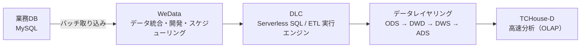
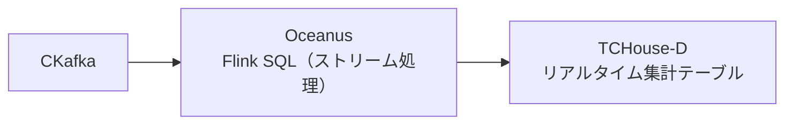

# Tencent Cloud Big Data Hands-on（お客様向け）

本リポジトリは、Tencent Cloud の大データ基盤を **短時間で全体像から体験できる Hands-on**（演習）向けの README です。

---

## 1. この Hands-on で解決したいこと（よくある課題）

多くの企業では、次のような状態になりがちです。

* 業務システム（例：MySQL）にデータはあるが、**分析用に整備できていない**
* 分析のたびに本番 DB に負荷をかけたくない（**安全に切り離したい**）
* バッチ、リアルタイム、BI、AI など用途が増え、**基盤が分断されやすい**
* 「どの製品をどう組み合わせると良いか」が分からず、**PoC から先に進みにくい**

本 Hands-on では、これらの課題に対して **“データを取り込み → 加工し → すぐ分析できる状態にする”** までを、代表的なシナリオで体験します。

---

## 2. 今日のゴール（Hands-on の到達点）

この Hands-on の到達点は以下です。

* **業務 DB（MySQL）→ 分析基盤**へのデータ取り込み方法を理解する
* **WeData + DLC** を使って、ETL（加工）と **データレイヤリング（ODS / DWD / DWS / ADS）** を体験する
* 集計結果を **TCHouse-D** に出力し、**高速にクエリできる**ことを確認する
* さらに発展として、**リアルタイム（CKafka + Oceanus）** や **Lakehouse、Notebook、BI** に広げられることを把握する

> 重要：本 Hands-on は “全機能の網羅” が目的ではなく、**全体像を短時間でつかみ、次の PoC/本番設計に繋げる** ことを目的とします。

---

## 3. 扱うシナリオ（代表例）

本 Hands-on では、次のような “よくある業務データ” を題材にします。

* MySQL のサンプルテーブル（ユーザー / 商品 / 注文）を用いて
  **日次バッチで取り込み → 加工 → 集計 → 分析** までを実施

ただし、このシナリオは **あくまで一例**です。実案件では、以下のような多様なケースに展開できます。

* アプリ/ゲームの行動ログ分析（イベント、課金、離脱など）
* EC の購買分析（カテゴリ別売上、RFM、キャンペーン効果）
* 金融・決済の集計/監視（不正検知の前段、集計基盤）
* IoT/製造の時系列データ（センサー、稼働ログ）
* 生成 AI/ML 分析（Notebook による特徴量作成・学習）

---

## 4. 全体アーキテクチャ（概要）

### 4.1 オフライン（バッチ）分析の基本フロー（本日メイン）

### 4.2 リアルタイム（拡張シナリオ）

---

## 5. 各プロダクトの役割

* **WeData**：データ統合・データ開発・ワークフロー/スケジューリング・ガバナンスの中核
* **DLC（Data Lake Compute）**：Serverless で ETL/分析を実行（SQL / Spark）
* **TCHouse-D**：集計・分析・BI 向けの高速クエリエンジン（OLAP）
* **Oceanus**：リアルタイム処理（Flink）で KPI を秒〜分単位で生成
* **COS（任意）**：ファイル/ログ/学習データなどを置くデータレイク（Notebook/AI に展開可能）

---

## 6. 今日やること（Hands-on の流れ）

1. 事前準備（権限・ネットワーク・エンジン確認）
2. **MySQL → DLC** のデータ取り込み（WeData のデータ統合タスク）
3. **DLC 上で ETL** を実行し、ODS/DWD/DWS/ADS を作成
4. 生成した ADS を **TCHouse-D** に連携し、クエリで結果確認
5.（時間があれば）リアルタイム / Lakehouse / Notebook / BI の拡張ポイント紹介

---

## 7. なぜこの構成が実案件で効くのか

* **運用負荷を抑えやすい**：Serverless を活用し、必要なところから始められる
* **段階的に拡張できる**：バッチからリアルタイム、BI、AI へ無理なく広げられる
* **標準テンプレート化に向く**：要件に応じて部品を差し替え、再利用しやすい

---

## 8. 次のステップ（PoC / 本番への展開）

Hands-on 実施後は、以下を起点に PoC/本番設計へ進められます。

* データ量・更新頻度・SLA を前提にした構成選定（DLC / EMR / Oceanus）
* データモデル（ドメイン・指標）の設計
* セキュリティ（権限/監査）と運用（アラート、リトライ、バックフィル）の設計
* BI/アプリ/API への提供方式の設計（TCHouse-D / 他 DB 連携 など）
