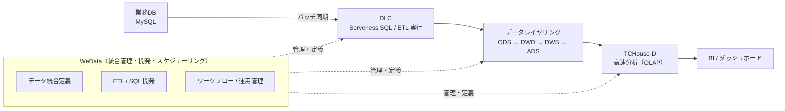
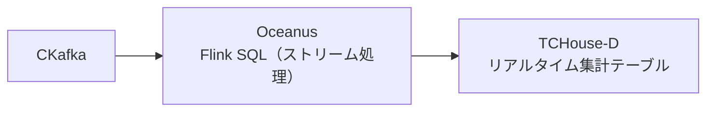

# Tencent Cloud Big Data Hands-on

（お客様向け・全体像理解用）

本リポジトリは、Tencent Cloud のビッグデータ基盤を
**短時間で全体像を把握しながら体験できる Hands-on（演習）** 向けの README です。

本 Hands-on では、特定の製品操作を細かく学ぶことよりも、
**「どのような構成で、どのようにデータ基盤を組み立てるか」** という
考え方と全体像の理解を重視しています。

---

## 1. この Hands-on で解決したいこと（よくある課題）

多くの企業では、次のような課題を抱えがちです。

* 業務システム（例：MySQL）にデータは存在するが、
  **分析用に整理・活用できていない**
* 分析や集計のたびに、本番 DB に
  **負荷をかけたくない／切り離したい**
* バッチ、リアルタイム、BI、AI など用途が増え、
  **データ基盤が分断されやすい**
* 「どの製品をどう組み合わせるべきか」が分からず、
  **PoC から本番に進みにくい**

本 Hands-on では、これらの課題に対して
**「データを取り込み → 加工し → すぐ分析できる状態にする」**
までを、代表的なシナリオを通じて体験します。

---

## 2. 今日のゴール（Hands-on の到達点）

本 Hands-on の到達点は以下のとおりです。

* **業務 DB（MySQL）から分析基盤へ**
  データを安全に取り込む方法を理解する
* **WeData + DLC** を用いた
  ETL（データ加工）と **データレイヤリング
  （ODS / DWD / DWS / ADS）** の考え方を体験する
* 集計結果を **TCHouse-D** に連携し、
  **高速にクエリできる**ことを確認する
* 将来的に、**リアルタイム分析（CKafka + Oceanus）** や
  **Lakehouse、Notebook、BI** に拡張できることを理解する

> **重要**
> 本 Hands-on は「全機能の網羅」を目的としたものではありません。
> **短時間で全体像を掴み、次の PoC や本番設計につなげること** を目的としています。

※ 本 Hands-on では、以下は詳細には扱いません。

* 本番向けの性能チューニング
* 個別業務に特化したデータモデル設計
* SLA / DR / マルチリージョン構成

---

## 3. 本 Hands-on で扱う代表シナリオ

本 Hands-on では、次のような **一般的な業務データ** を題材にします。

* MySQL のサンプルテーブル（ユーザー / 商品 / 注文）を用い、
  **日次バッチで
  取り込み → 加工 → 集計 → 分析** までを実施

ただし、このシナリオは **あくまで一例** です。
実案件では、以下のような多様なケースに展開できます。

* アプリ / ゲームの行動ログ分析（イベント、課金、離脱など）
* EC の購買分析（カテゴリ別売上、RFM、キャンペーン効果）
* 金融・決済の集計 / 監視（不正検知の前段、集計基盤）
* IoT / 製造の時系列データ（センサー、稼働ログ）
* 生成 AI / 機械学習分析
  （Notebook を用いた特徴量作成・学習）

---

## 4. 全体アーキテクチャ（概要）

### 4.1 オフライン（バッチ）分析の基本フロー（本 Hands-on の中心）

以下は、本 Hands-on で実際に体験する
**オフライン分析の全体像** です。

---

### 4.2 リアルタイム分析（拡張シナリオ）

---

## 5. 各プロダクトの役割

* **WeData**
  データ統合・データ開発・ワークフロー / スケジューリング・
  ガバナンスを担う **制御プレーン（Control Plane）**
* **DLC（Data Lake Compute）**
  Serverless で ETL / 分析を実行（SQL / Spark）
* **TCHouse-D**
  集計・分析・BI 向けの高速クエリエンジン（OLAP）
* **Oceanus**
  リアルタイム処理（Flink）により KPI を秒〜分単位で生成
* **COS（任意）**
  ファイル / ログ / 学習データを格納するデータレイク
  （Notebook / AI 分析へ展開可能）

---

## 6. 今日やること（Hands-on の流れ）

1. 事前準備（権限・ネットワーク・エンジン確認）
2. **MySQL → DLC** のデータ取り込み
   （WeData のデータ統合タスク）
3. **DLC 上で ETL** を実行し、
   ODS / DWD / DWS / ADS を作成
4. 生成した ADS を **TCHouse-D** に連携し、
   クエリで結果を確認
5.（時間があれば）
   リアルタイム / Lakehouse / Notebook / BI の拡張ポイント紹介

---

## 7. なぜこの構成が実案件で有効なのか

* **運用負荷を抑えやすい**
  Serverless を活用し、必要なところから段階的に導入できる
* **拡張しやすいアーキテクチャ**
  バッチからリアルタイム、BI、AI へ無理なく発展可能
* **標準テンプレート化に向く**
  SI による再利用・横展開がしやすい

---

## 8. 次のステップ（PoC / 本番への展開）

Hands-on 実施後は、以下を起点に PoC / 本番設計へ進められます。

* データ量・更新頻度・SLA を前提とした構成選定
  （DLC / EMR / Oceanus）
* データモデル（ドメイン・指標）の設計
* セキュリティ（権限 / 監査）および運用
  （アラート、リトライ、バックフィル）の設計
* BI / アプリ / API への提供方式の設計
  （TCHouse-D / 他 DB 連携 など）
